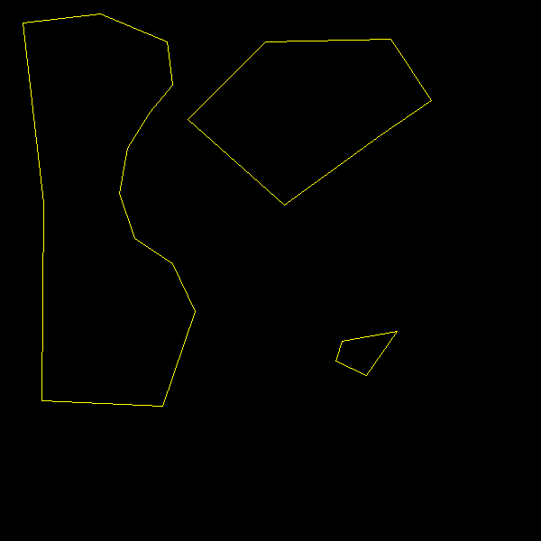
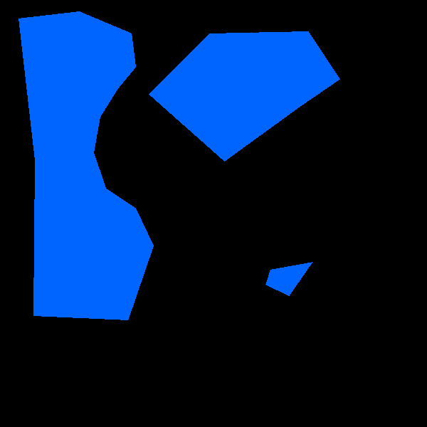

# Area spreader

This is an idea of how to include the waterlogged areas (or anything really) into the clhc processor. It currently works best with continuous data, so I came up with an idea to get this form waterlogged areas.

As you said, the farmer knows the land and would be able to identify waterlogged areas. For instance:

The quick and dirty solution would be assigning a number to the areas:

Waterlogged, 1, blue

Non-waterlogged, 0, black

A better solution, in my opinion, would be to supply a distance where there would be a transition from areas to non-areas (based on a little script I wrote):

This would make the data "more" continuous. The Idea can also be extended to different levels too (none, low, med, high) and would produce quite detailed maps; great as inputs into the clhc processor.
